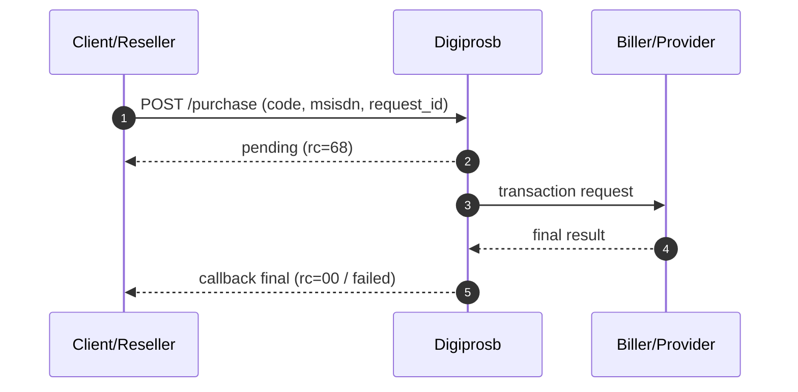
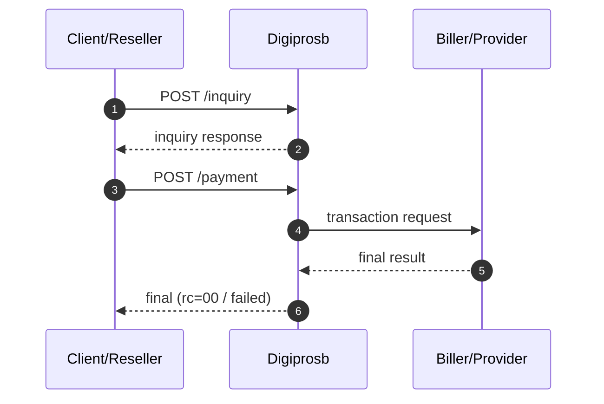

# Introduction & integration prep

## Introduction

Digiprosb provides a reseller API for prepaid transactions over a host-to-host connection.

### Base URL

```
https://api.digiprosb.id/reseller/api/v1
```

### Authentication

- **Header** : `Authorization: Bearer <JWT>`  
  The token is obtained from the **Settings** page (reseller portal).

### Transaction fields

The following fields are required when performing a transaction:

- `code`: product code (SKU)
- `msisdn`: destination number / destination ID as applicable to the product
- `request_id`: unique ID from the client side


## Integration prep

Checklist before you start calling the production API.

### 1. Static IP & whitelist

- Ensure the integration server uses a **static IP** (or an agreed range).
- Send the IP to the Digiprosb team for **whitelisting** on the API side.
- Without a whitelist, requests may be rejected at the network or application layer.

### 2. Token (JWT)

1. Log in to the Digiprosb reseller portal.
2. Open **Settings**.
3. Copy the token and store it as a secret.
4. Header: `Authorization: Bearer <token>`.


### 3. `request_id` convention

- Must be **unique per new transaction attempt** from your side.
- If you resend a `request_id` that has **already been processed** on the Digiprosb server, the API returns the **same response** as that transaction (idempotency).


### 4. HTTPS

Always use **HTTPS** for all API calls.

## Transaction flow

### Direct purchase without inquiry

Used when the product does not need a pre-check.

1. (Optional) `GET /saldo`
2. `POST /purchase`
3. The Digiprosb server responds **pending** (`rc=68`) on the first request
4. After responding pending, Digiprosb forwards the request to the biller/provider
5. When the biller returns the final result, Digiprosb sends the final result to the Client/Reseller as a **callback**



### Payment with inquiry

Used when the product needs validation first (for example: PLN, DANA — then `POST /payment`).

1. `POST /inquiry`
2. Validate the inquiry result (`rc=00`, customer/product data)
3. `POST /purchase`
4. If `rc=68`, continue with `POST /status`



### Quick reference

- Purchase prepaid: [Pulsa & Data Purchase](transaksi-direct/pembelian-pulsa-data.md)
- Purchase game: [Game & Voucher Topup](game/topup-voucher.md)
- Purchase ewallet: [Ewallet Direct Purchase](ewallet/ewallet-direct-purchase.md)
- PLN Prepaid: [PLN Prepaid](pln-prepaid.md)
- E-wallet open amount (inquiry → payment): [Ewallet Open Amount](ewallet/e-wallet-open-amount.md)
- Callback (final result): [Callback](callback.md)
