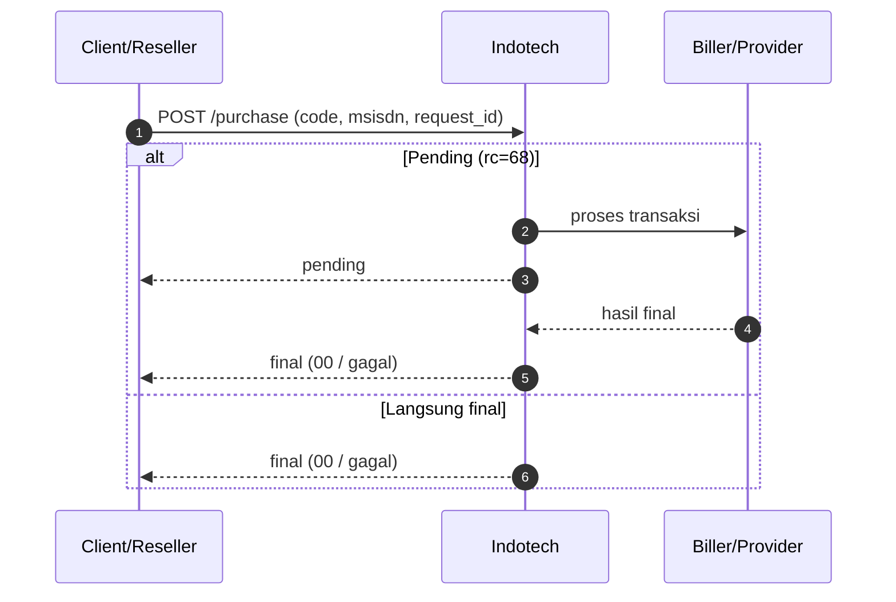
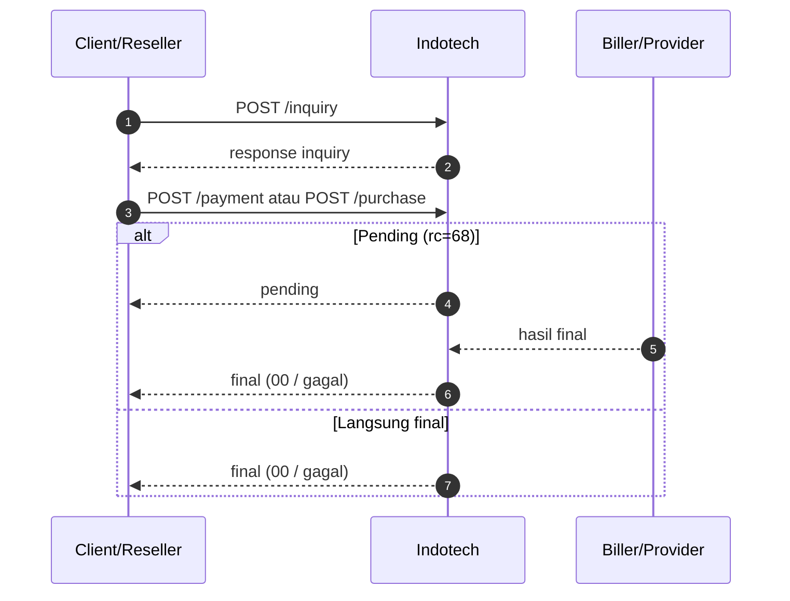

# Pengenalan & persiapan integrasi

## Pengenalan

SOCX menyediakan API reseller untuk transaksi prabayar via koneksi host-to-host.

### Base URL

```
https://indotechapi.socx.app/reseller/api/v1
```

### Autentikasi

- **Header** : `Authorization: Bearer <JWT>`  
  Token diperoleh dari halaman **Settings** (portal reseller).

### Field Transaksi

Berikut adalah field yang wajib disertakan saat melakukan transaksi:

- `code`: kode produk (SKU)
- `msisdn`: nomor tujuan / ID tujuan sesuai produk
- `request_id`: ID unik dari sisi client


## Persiapan integrasi

Checklist sebelum mulai hit API production.

### 1. IP statis & whitelist

- Pastikan server integrasi memakai **IP statis** (atau rentang yang disepakati).
- Kirim IP ke tim SOCX untuk **whitelist** di sisi API.
- Tanpa whitelist, request dapat ditolak di layer jaringan atau aplikasi.

### 2. Token (JWT)

1. Login ke portal reseller SOCX.
2. Buka **Settings**.
3. Salin token dan simpan sebagai rahasia .
4. Header: `Authorization: Bearer <token>`.


### 3. Konvensi `request_id`

- Harus **unik per percobaan transaksi baru** dari sisi Anda.
- Jika Anda mengirim ulang `request_id` yang **sudah pernah diproses** di server SOCX, API mengembalikan **respons yang sama** dengan transaksi tersebut (idempotensi).


### 4. HTTPS

Selalu gunakan **HTTPS** untuk semua panggilan API.

## Alur transaksi

### Direct purchase tanpa inquiry

Dipakai saat produk tidak butuh pre-check.

1. (Opsional) `GET /saldo`
2. `POST /purchase`
3. Cek `rc` di respons
4. Jika `rc=68`, lanjut `POST /status` sampai final



### Payment dengan inquiry

Dipakai saat produk butuh validasi dulu (contoh: PLN, DANA — lalu `POST /payment`).

1. `POST /inquiry`
2. Validasi hasil inquiry (`rc=00`, data pelanggan/produk)
3. `POST /purchase`
4. Jika `rc=68`, lanjut `POST /status`



### Referensi cepat

- Purchase prepaid: [Pembelian Pulsa & Data](transaksi-direct/pembelian-pulsa-data.md)
- Purchase game: [Top Up & Voucher](game/topup-voucher.md)
- Purchase ewallet: [Ewallet Direct Purchase](transaksi-direct/pembelian-ewallet.md)
- Inquiry PLN: [Inquiry PLN](inquiry/inquiry-pln.md)
- E-wallet open amount (inquiry → payment): [Ewallet Open Amount](ewallet/e-wallet-open-amount.md)
