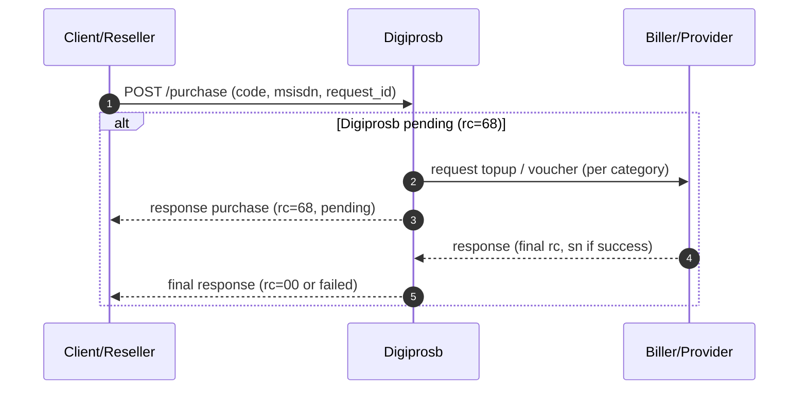

# Direct Purchase without Inquiry

The **direct purchase without inquiry** flow means you call **`POST /purchase`** directly without a prior **`POST /inquiry`** step. Suitable for many products: **pulsa/data**, **game** (top-up / voucher per catalog), **e-wallet direct**, and others as long as the SKU does not require a pre-check inquiry.

## Integration steps summary

1. **(Optional)** [`GET /saldo`](cek-saldo.md) — check balance before large transactions.
2. **`POST /purchase`** — send `code`, `msisdn`, and a unique `request_id` for the category:
   [pulsa/data](pembelian-pulsa-data.md), [game — Topup Game & Voucher](../game/topup-voucher.md), or [ewallet](../ewallet/ewallet-direct-purchase.md).
3. **Read `rc`** in the response — see [response codes](kode-respons.md).
4. If **`rc = 68` (pending)** — poll [`POST /status`](cek-status.md) until a final status, or wait for callback if already agreed.

## Flow diagram (reference from game classification)

The diagram below matches the **Game product classification** section in [Game Top-up & Voucher](../game/topup-voucher.md#game-product-classification): one purchase request to Digiprosb, with a pending branch until the final result from the biller.

## Game product details (without inquiry)

For `msisdn` parameters, `sn` interpretation, and examples per `code` — follow **[Topup Game & Voucher](../game/topup-voucher.md)**.

## Related links

| Topic | Page |
|-------|------|
| JSON request & response fields | [Pembelian Pulsa & Data](pembelian-pulsa-data.md), [Topup Game & Voucher](../game/topup-voucher.md), [Ewallet Direct Purchase](../ewallet/ewallet-direct-purchase.md) |
| Pending & polling | [Check status](cek-status.md) |
| `rc` table | [Response codes](kode-respons.md) |
| Direct purchase folder summary | [Transactions — direct purchase](README.md) |
