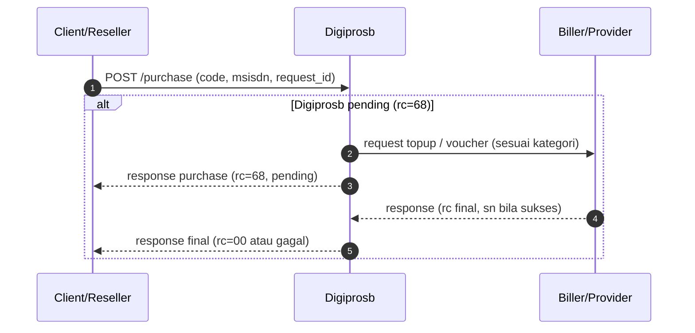

# Direct Purchase without Inquiry

Alur **direct purchase tanpa inquiry** berarti Anda memanggil **`POST /purchase`** langsung tanpa langkah **`POST /inquiry`** terlebih dahulu. Cocok untuk banyak produk: **pulsa/data**, **game** (top-up / voucher sesuai katalog), **e-wallet direct**, dan lainnya selama SKU tidak mewajibkan pre-check inquiry.

## Ringkasan langkah integrasi

1. **(Opsional)** [`GET /saldo`](cek-saldo.md) — cek saldo sebelum transaksi besar.
2. **`POST /purchase`** — kirim `code`, `msisdn`, `request_id` unik sesuai kategori:
   [pulsa/data](pembelian-pulsa-data.md), [game — Topup Game & Voucher](../game/topup-voucher.md), atau [ewallet](../ewallet/ewallet-direct-purchase.md).
3. **Baca `rc`** pada respons — lihat [kode respons](kode-respons.md).
4. Jika **`rc = 68` (pending)** — polling [`POST /status`](cek-status.md) hingga status final, atau tunggu callback jika sudah disepakati.

## Diagram alur (referensi dari klasifikasi game)

Diagram berikut sama dengan bagian **Alur direct purchase (umum)** di [Topup Game & Voucher](../game/topup-voucher.md#klasifikasi-produk-game): satu permintaan purchase ke Digiprosb, dengan cabang pending hingga hasil final dari biller.

## Detail produk game (tanpa inquiry)

Parameter `msisdn`, interpretasi `sn`, dan contoh per `code` — ikuti **[Topup Game & Voucher](../game/topup-voucher.md)**.

## Link terkait

| Topik | Halaman |
|-------|---------|
| Request & field respons JSON | [Pembelian Pulsa & Data](pembelian-pulsa-data.md), [Topup Game & Voucher](../game/topup-voucher.md), [Ewallet Direct Purchase](../ewallet/ewallet-direct-purchase.md) |
| Pending & polling | [Cek status](cek-status.md) |
| Tabel `rc` | [Kode respons](kode-respons.md) |
| Ringkasan folder direct purchase | [Transaksi — direct purchase](README.md) |
