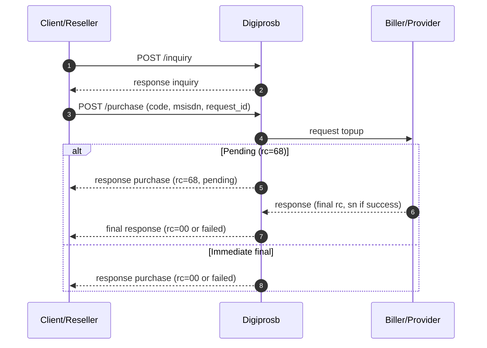

# payment with inquiry

The **payment with inquiry** flow means you call **`POST /inquiry`** first to **validate the customer / product information**, then perform the debit with parameters consistent with the inquiry result.

| Product | Endpoint after inquiry |
|---------|------------------------|
| **E-wallet open amount** | `POST /payment` — fields `code`, `idpel`, new `request_id` |
| Pulsa, game, e-wallet direct, PLN purchase, etc. | `POST /purchase` — fields per category |

Used when the SKU or biller requires a pre-check before debit (examples: **PLN prepaid**, **e-wallet open amount**, other products per catalog).

Request details (payload) follow the Digiprosb API contract for your product.

## Integration steps summary

1. **`POST /inquiry`** — send `code` and required fields (e.g. `idpel` for PLN); ensure `rc = 00` and display data (`info[]`) match UI needs. Examples: [PLN Prepaid](../pln-prepaid.md), [Ewallet Open Amount V1](../ewallet/e-wallet-open-amount.md), [Ewallet Open Amount V2](../ewallet/e-wallet-open-amount-v2.md).
2. **Debit** — `POST /payment` (open amount) or `POST /purchase` (other categories). References:
   [Ewallet Open Amount V1](../ewallet/e-wallet-open-amount.md), [Ewallet Open Amount V2](../ewallet/e-wallet-open-amount-v2.md), [pulsa/data](pembelian-pulsa-data.md), [game — Topup Game & Voucher](../game/topup-voucher.md), [ewallet direct](../ewallet/ewallet-direct-purchase.md).
3. **Read `rc`** — same as the without-inquiry flow; see [response codes](kode-respons.md).
4. If **`rc = 68`** — [`POST /status`](cek-status.md) or callback (if available).

## Flow diagram (inquiry → purchase)

## Per-product references

| Product / topic | Page |
|-----------------|------|
| General inquiry contract | [Inquiry & catalog](../inquiry/README.md) |
| PLN Prepaid | [PLN Prepaid](../pln-prepaid.md) |
| PLN prepaid | [PLN Prepaid](../pln-prepaid.md) |
| E-wallet open amount (inquiry → payment) | [Ewallet Open Amount V1](../ewallet/e-wallet-open-amount.md) · [Ewallet Open Amount V2](../ewallet/e-wallet-open-amount-v2.md) |

## Notes

- Mapping **`idpel` ↔ `msisdn`** or other fields follows the **product list** from the API team for the inquiry → purchase flow.
- If the purchase `request_id` matches an existing transaction, idempotency behavior follows the purchase contract per category.
- If the response is `rc=68`, the transaction is considered **pending**.
- If a purchase request uses the same `request_id`, Digiprosb returns the existing transaction data according to the latest data in the system.
