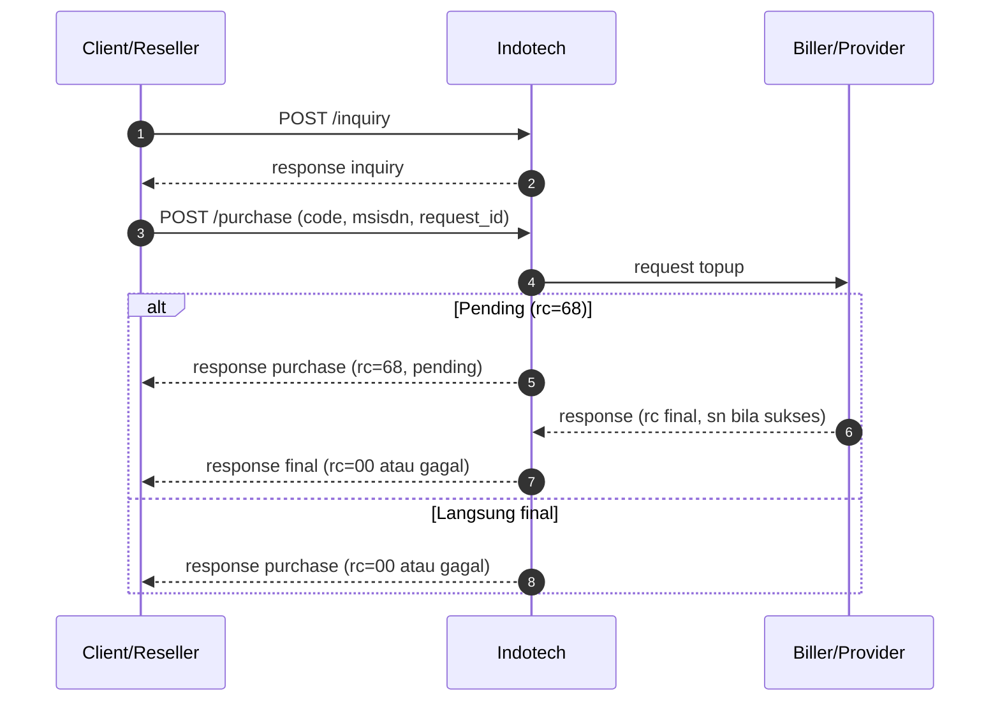

# payment with inquiry

Alur **payment with inquiry** berarti Anda memanggil **`POST /inquiry`** terlebih dahulu untuk **validasi pelanggan / informasi produk**, lalu melakukan debit dengan parameter yang konsisten dari hasil inquiry.

| Produk | Endpoint setelah inquiry |
|--------|---------------------------|
| **E-wallet open amount** | `POST /payment` — field `code`, `idpel`, `request_id` baru |
| Pulsa, game, e-wallet direct, PLN purchase, dll. | `POST /purchase` — field sesuai kategori |

Dipakai ketika SKU atau biller mewajibkan pre-check sebelum debit (contoh: **PLN prabayar**, **e-wallet open amount**, produk lain sesuai katalog).

Request detail (payload) mengikuti kontrak SOCX/API untuk produk Anda.

## Ringkasan langkah integrasi

1. **`POST /inquiry`** — kirim `code` dan field yang diminta (mis. `idpel` untuk PLN); pastikan `rc = 00` dan data tampilan (`info[]`) sesuai kebutuhan UI. Contoh: [Inquiry PLN](../inquiry/inquiry-pln.md), [Ewallet Open Amount](../ewallet/e-wallet-open-amount.md).
2. **Debit** — `POST /payment` (open amount) atau `POST /purchase` (kategori lain). Referensi:
   [Ewallet Open Amount](../ewallet/e-wallet-open-amount.md), [pulsa/data](pembelian-pulsa-data.md), [game — Top Up & Voucher](../game/topup-voucher.md), [ewallet direct](pembelian-ewallet.md).
3. **Baca `rc`** — sama dengan alur tanpa inquiry; lihat [kode respons](kode-respons.md).
4. Jika **`rc = 68`** — [`POST /status`](cek-status.md) atau callback (jika ada).

## Diagram alur (inquiry → purchase)

## Referensi per produk

| Produk / topik | Halaman |
|----------------|---------|
| Kontrak umum inquiry | [Inquiry & katalog](../inquiry/README.md) |
| Inquiry PLN | [Inquiry PLN](../inquiry/inquiry-pln.md) |
| PLN prabayar | [Inquiry PLN](../inquiry/inquiry-pln.md) |
| E-wallet open amount (inquiry → payment) | [Ewallet Open Amount](../ewallet/e-wallet-open-amount.md) |

## Catatan

- Mapping **`idpel` ↔ `msisdn`** atau field lain mengikuti **daftar produk** dari tim API untuk alur inquiry → purchase.
- Jika `request_id` purchase sama dengan transaksi yang sudah ada, perilaku idempotensi mengikuti kontrak purchase per kategori.
- Jika respons `rc=68`, transaksi dianggap **pending**.
- Jika request purchase menggunakan `request_id` yang sama, SOCX mengembalikan data transaksi yang sudah ada sesuai data terakhir di sistem.
